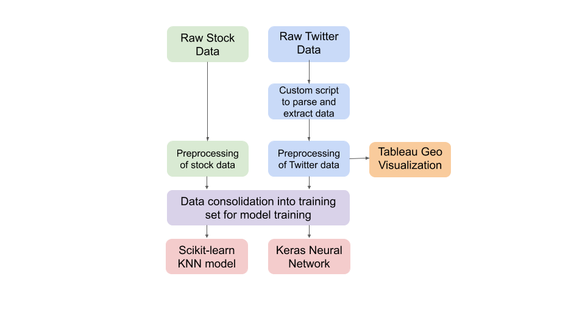
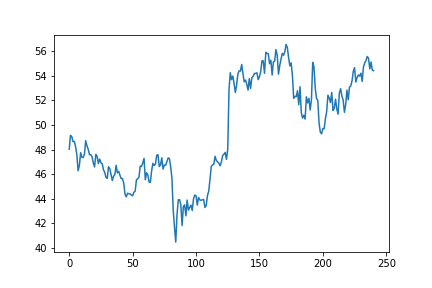
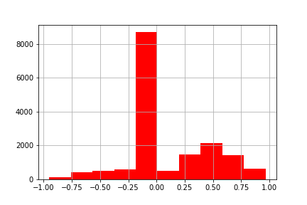
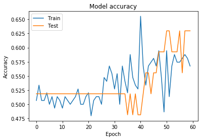
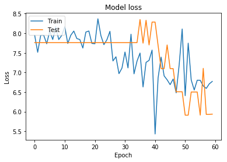

# Predicting Stok Performance using Twitter Data 🐦
A case study in stock close delta prediction based on twitter data

## Abstract
Stock market prediction has been a topic of much interest since the emergence of the Internet. Fluctuations in a company’s stock price are a broad reflection of their public perception and their current performance as viewed by shareholders. Social media has become the most popular outlet of people’s opinion in our day and age. The motivation of this project is to track a company’s perception on social media, specifically twitter, and see if it can be used as an indicator or predictor to their stock performance. For the purpose of this project I chose to focus on Microsoft as a case study, and see if I can accurately model and understand Twitter data’s correlation to their stock performance. The main goals of this project is to understand the geographical distribution of interest in Microsoft stock over time and to train a prediction model that can predict whether a stock price will go up or down given historical stock/twitter data. I used a visualization program Tableau to plot the geographic distribution of the tweets over time. I found that Washington, California, and New York were consistently more vocal about Microsoft in general. For the stock prediction problem, I formulated it as a binary classification problem with outcomes being up or down for the direction of the stock price. I tested various machine learning models to see which had the best prediction performance and found scikit-learn KNearestNeighbors (KNN) and a Keras Squential Neural Network to be the best approach. Overall, the model accuracy hit a ceiling at ~60%. There are a few challenges that made it difficult to have an extremely accurate model and I will discuss those in the results section.

### Data Flow

### Geographic Visualization

### Micrsoft Stock Close (2015-2016)

### Tweet Sentiment Overtime

### Neural Network Training Accuracy and Loss

